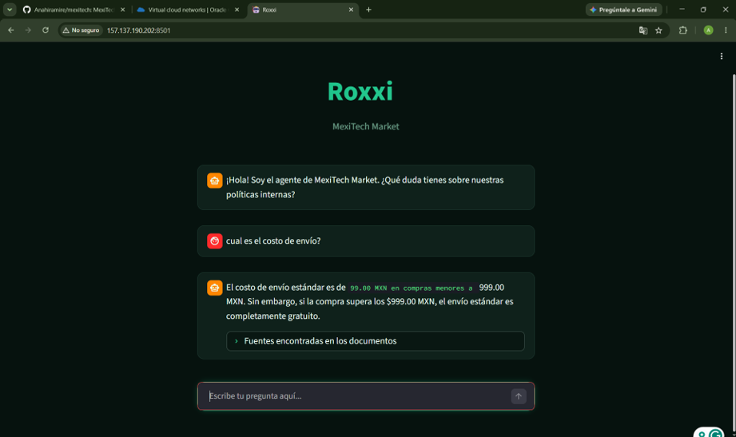

# mexitech
MexiTech Market RAG Assistant — Enterprise AI Chatbot powered by LangChain, FAISS, and Groq LLMs. UI built with Streamlit and deployed on Oracle Cloud Infrastructure (OCI).

El sistema combina el poder del modelo de lenguaje **Google Gemini** con la búsqueda vectorial rápida de **FAISS** a través de **LangChain**, todo presentado en una interfaz interactiva creada con **Streamlit**.

---

## Características principales

* **Carga e indexación dinámica:** Procesamiento de documentos PDF y archivos JSON.
* **Búsqueda Semántica:** Generación de embeddings vectoriales indexados con FAISS para recuperar únicamente la información relevante.
* **Modelo LLM de Alta Precisión:** Integración con la API de Google Gemini (`langchain-google-genai`).
* **Interfaz de Chat:** Desarrollada con Streamlit para una experiencia sencilla y fluida.

## Evidencia de Despliegue en la Nube (OCI)

A continuación se muestra la aplicación ejecutándose correctamente en una instancia **Ubuntu Server en Oracle Cloud Infrastructure (OCI)**:

